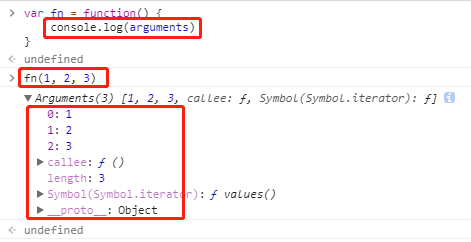

## JS 中的数组到底是什么？

JS 中的数组其实就是一种特殊的对象。

```javascript
typeof [1, 2, 3]  // "object"
```

它和狭义上的对象的本质区别就是，键名是按次序排列的一组整数（0，1，2 ...），且继承了 `Array.prototype` 属性，可以调用一系列 Array 提供的方法。


## 伪数组

如果一个对象的所有键名是按次序排列的一组整数（0，1，2 ...），含有 `length` 属性且没有继承 `Array.prototype` 属性，不具备数组特有的方法，那么这个对象就是伪数组。语法上称为“类似数组的对象”。

例如函数的 `arguments` 对象就是一个伪数组：



以及大多数 DOM 返回的元素集也是伪数组。


## 数组的常用方法

### 静态方法

- Array.isArray()

该方法返回一个布尔值，表示传入的参数是否为数组。可以弥补 `typeof` 运算符的不足。

```javascript
var arr = [1, 2, 3]
typeof arr  // "object"
Array.isArray(arr)  // true
```

### 实例方法

- Array.prototype.sort()

**使用该方法原数组将被改变。**

`sort()` 方法对数组成员进行排序，默认是按照字典顺序排序(不是大小顺序)。

如果需要按照自定义顺序排序，需要传入一个函数参数，参数函数可以接受两个参数，表示进行比较的两个数组元素。如果该函数的返回值大于0，表示第一个元素排在第二个元素后面；其他情况下，都是第一个元素排在第二个元素前面。

```javascript
['d', 'c', 'b', 'a'].sort()  // ['a', 'b', 'c', 'd']
[4, 3, 2, 1].sort()  // [1, 2, 3, 4]
[11, 101].sort()  // [101, 11]

// 按照分数从高到低排序
var arr = [
  { name: '小光', score: 98 },
  { name: '小张', score: 100 },
  { name: '小毕', score: 96 }
]
arr.sort(function(a, b) {
    return b.score - a.score
})
arr
// [
//   { name: '小张', score: 100 },
//   { name: '小光', score: 98 },
//   { name: '小毕', score: 96 }
// ]
```

- Array.prototype.filter()
    
`filter()` 方法用于过滤数组元素。它接受一个函数参数，参数函数可以接受三个参数：当前元素，当前位置和整个数组。所有数组元素依次执行该函数，返回结果为 `true` 的元素组成一个新数组。

```javascript
// 筛选出所有偶数
var arr = [1, 2, 3, 4, 5, 6, 7, 8, 9, 10]
arr.filter(function(n) {
  return n % 2 === 0
})  // [2, 4, 6, 8, 10]
```

- Array.prototype.forEach()

**该方法不返回值，只用来操作原数组，且可以改变原数组。**

`forEach()` 方法对数组的所有元素依次执行参数函数，参数函数可以接受三个参数：当前元素、当前位置、数组本身。

```javascript
var arr = [
  { name: '小光', score: 98 },
  { name: '小张', score: 100 },
  { name: '小毕', score: 96 }
]
arr.forEach(function(element, index) {
  console.log('[' + index + '] ' + element.name + ': ' + element.score)
})
// [0] 小光: 98
// [1] 小张: 100
// [2] 小毕: 96
```

- Array.prototype.map()

**该方法有返回值。如果遍历数组是为了得到返回值，那么使用 map，否则使用 forEach。**

`map()` 方法与 `forEach()` 方法很相似，也是对数组的所有元素依次执行参数函数，参数函数同样接受三个参数：当前元素、当前位置、数组本身。然后把执行结果组成一个新数组返回，不改变原数组。

```javascript
var arr = [1, 2, 3, 4]
arr.map(function(n) {
  return n * 2
})  // [2, 4, 6, 8]
```

- Array.prototype.reduce()

`reduce()` 方法依次处理数组的每个元素，最终累计为一个值。

```javascript
// 所有元素求和
var arr = [1, 2, 3, 4]
arr.reduce(function(a, b) {
  return a + b
})  // 10
```

- 用 `reduce()` 实现 `filter()`

```javascript
// 筛选出所有偶数
var arr = [1, 2, 3, 4, 5, 6, 7, 8, 9, 10]
arr.reduce(function(arr, n) {
  if(n % 2 ===0) {
    arr.push(n)
  }
  return arr
}, [])  // [2, 4, 6, 8, 10]
```

- 用 `reduce()` 实现 `map()`

```javascript
// 所有元素乘以 2
var arr = [1, 2, 3, 4]
arr.reduce(function(arr, n) {
  arr.push(n * 2)
  return arr
}, [])  // [2, 4, 6, 8]
```

更多详细参考：[阮一峰《JavaScript 标准参考教程》- Array 对象](http://javascript.ruanyifeng.com/stdlib/array.html)