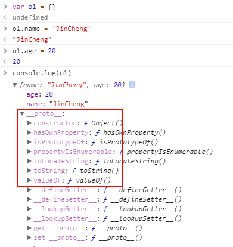
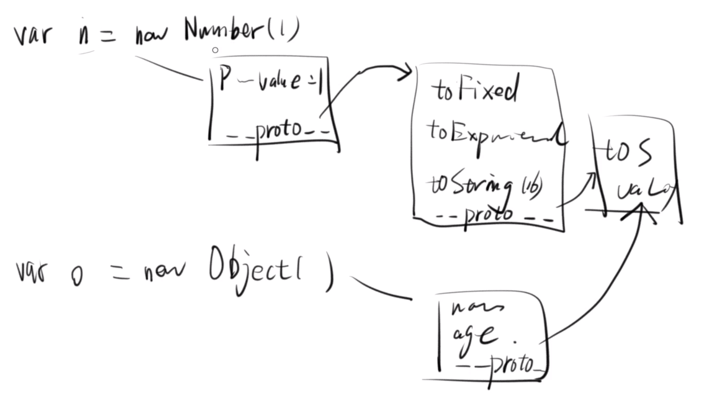
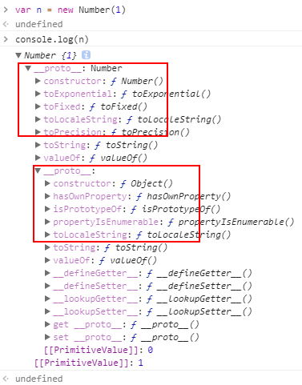
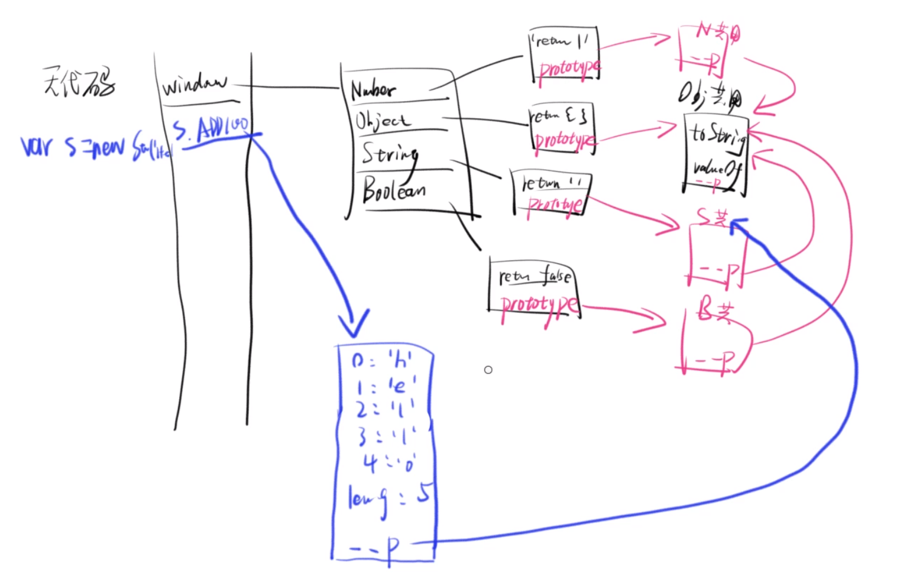

## 公用属性

用全局函数包装下面几个对象：

```javascript
var n = new Number(1)
var s = new String('hello')
var b = new Boolean(true)
var o = new Object()
```

可以发现，他们都可以调用例如 `toString()` 和 `valueOf()` 等一些方法。

那如果每一个对象都自己去存有这些属性，一个明显的问题就是会造成资源的浪费。

**JS 的解决办法就是，把这些函数统一放在一个对象里（暂且叫做公用属性组成的对象）。当声明一个新的对象时，就给这个新的对象添加一个隐藏的属性 `__proto__`，在这个属性中去存公用属性对象的 Heap 地址，这样就完成了对公用属性的引用。**

### Object 对象的公用属性

举个例子：

```javascript
var o1 = {}
o1.name = 'JinCheng'
o1.age = 20
console.log(o1)
```



就会发现额外隐藏的 `__proto__` 属性。

当调用 `o1.toString()` 时：

1. 首先会看 `o1` 是不是对象，如果不是，就临时包装成对象。

2. 再看 `o1` 自身有没有 `toString` 这个属性可供调用。

3. 如果没有这个属性，就会自动去调用 `__proto__` 对象里的属性方法。

简单的验证：

```javascript
// 再声明一个对象 o2
var o2 = {
    name: 'JinCheng',
    age: 20
}
o1 === o2  // false 因为 Heap 地址不同
o1.toString === o2.toString  // true 可以发现他们调用的其实是同一个公用属性
```

### 非 Object 对象的公用属性

以 Number 对象为例（String 对象和 Boolean 对象同理）：

```javascript
var n = new Number(1)
```

我们知道除了上面所有对象的公用属性之外，Number 对象还有它自己的一些属性方法。

例如：`toFixed()` 和 `toExponential()` 等，这些是只有 Number 对象才公用的属性。

声明一个 Object 对象：`var o = new Object()` 它是不能调用这些属性方法的，因为它的 `__proto__` 属性直接引用了 Object 对象的公用属性。

所以 Number 对象的 `__proto__` 属性就不能直接引用 Object 对象的公用属性，否则它也就同样没有办法调用这些属性方法了。

**解决办法就是，Number 对象的 `__proto__` 属性要先引用 Number 的公用属性对象，又因为这个被引用的公用属性对象其实也是一个对象，所以在这个 Number 的公用属性对象里面还会再有一个 `__proto__` 属性去引用 Object 的公用属性。**



在控制台打印出 `n`，就可以看到两层 `__proto__` ：



注意：

1. 如果对象自身和它的公用属性对象，都定义了一个同名属性，那么优先读取对象自身的属性，这叫做“覆盖”。

2. 这些同名属性不是同一个方法，他们不相等，可能有不同的用法。例如：

    ```javascript
    // Number 对象 toString 方法可以接受一个参数，表示输出的进制
    var n = 10
    n.toString(8)  // '12'
    
    // Object 对象 toString 方法不能接参数
    var o = {}
    o.toString()  // "[object Object]"
    
    // 验证
    n.toString === o.toString  // false
    ```


## Prototype（原型对象）

上面的那些公用属性对象其实就叫做 Prototype（原型对象）。

JavaScript 规定，所有对象都有自己的原型对象（prototype）。

他们各自存在相应对象的 `prototype` 属性中，JS 引擎在初始化全局对象时就会构建他们。



简单的验证：

```
var o = {}
o.__proto__ === Object.prototype  // true

var n = new Number(1)
n.__proto__ === Number.prototype  // true
n.__proto__.__proto__ === Object.prototype  // true

var s = new String('hello')
s.__proto__ === String.prototype  // true
s.__proto__.__proto__ === Object.prototype  // true

var b = new Boolean(true)
b.__proto__ === Boolean.prototype  // true
b.__proto__.__proto__ === Object.prototype  // true
```


## 原型链

**上面图例中的，从蓝色的线到 String 的 `prototype`，再到 Object 的 `prototype`，就是一条原型链。**

如果一层层地上溯，所有对象的原型最终都可以上溯到 `Object.prototype`。也就是说，所有对象都继承了 `Object.prototype` 的属性。这就是所有对象都有 `toString` 和 `valueOf` 方法的原因。

那么，`Object.prototype` 对象有没有它的原型呢？回答是 `Object.prototype` 的原型是 `null`。`null` 没有任何属性和方法，也没有自己的原型。因此，原型链的尽头就是 `null`。