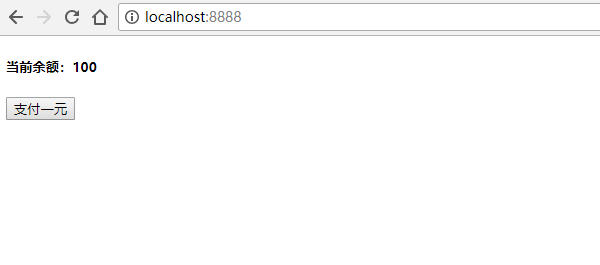

JSONP 是服务器与客户端跨源通信的常用方法。

它的基本思想是，通过动态创建 `<script>` 元素向服务器发起请求，这种做法**不受同源政策限制**。服务器收到请求后，将数据放在一个指定名字的回调函数里传回来。

通过一个简单的例子来理解 JSONP 到底是什么。

Demo 地址：https://github.com/JinChengJoker/jsonp-demo

## 简易服务器

用 node.js 搭一个简易的服务器 `server.js`：

```javascript
var http = require('http')
var url = require('url')
var fs = require('fs')
var port = process.argv[2]

// 判断是否传入端口号参数
if(!port) {
    console.log('请指定端口号！\n例如：node server.js 8888')
    process.exit(1)
}

// 创建服务器
var server = http.createServer(
    function(request, response) {
        var temp = url.parse(request.url, true)
        var path = temp.pathname
        var query = temp.query
        console.log('HTTP 请求路径为：\n' + path)
        // 判断 HTTP 请求路径
        if(path === '/') {
            var data = fs.readFileSync('./index.html', 'utf8')
            response.setHeader('Content-Type', 'text/html; charset=utf-8')
            response.write(data)
            response.end()
        } else {
            // 找不到对应的请求路径，返回错误码404
            response.statusCode = 404
            response.end()
        }
    }
)

// 监听传入的端口号
server.listen(port)
console.log('监听' + port + '成功！\n请在浏览器打开 http://localhost:' + port)
```


## 访问服务器

启动服务器 `node server.js 8888`，监听 `8888` 端口。

在浏览器访问 `http://localhost:8888/`，返回当前文件夹下的 `index.html`：

```
<!DOCTYPE html>
<html lang="zh-Hans">
<head>
    <meta charset="UTF-8">
    <meta name="viewport" content="width=device-width, initial-scale=1.0">
    <meta http-equiv="X-UA-Compatible" content="ie=edge">
    <title>jsonp demo</title>
</head>
<body>
    <h5>当前余额：<span id="amount">100</span></h5>
    <button id="btn">支付一元</button>

    <script>
        btn.addEventListener('click', function(e) {
            amount.innerText -= 1
        })
    </script>
</body>
</html>
```




## 简易数据库文件

在当前文件下创建 `db` 文件，存入数字 `100`。

修改 `index.html` 文件，将 `100` 替换为占位符 `&&amount&&`：

```
<span id="amount">&&amount&&</span>
```

修改 `server.js` 文件，读取 `db` 文件数据，然后将响应数据中的占位符 `&&amount&&` 替换为真实数据：

```javascript
if(path === '/') {
    var amount = fs.readFileSync('./db', 'utf8')
    var data = fs.readFileSync('./index.html', 'utf8')
    data = data.replace('&&amount&&', amount)
    response.setHeader('Content-Type', 'text/html; charset=utf-8')
    response.write(data)
    response.end()
}
```

重启 `server.js`，再次访问 `http://localhost:8888/`，结果与之前一致。


## 创建 script 元素发起请求（SRJ 方案）

可以在 `index.html` 中动态创建一个 `<script>` 元素，并用它的 `src` 属性来发起请求，同时监听 `load` 和 `error` 来判断是否执行成功，并在之后删除该 `<script>` 元素：

```javascript
btn.addEventListener('click', function() {
    addScriptTag('/pay')
})

function addScriptTag(src) {
    var script = document.createElement('script')
    script.src = src
    document.body.appendChild(script)
    script.onload = function(e) {
        e.currentTarget.remove()
    }
    script.onerror = function(e) {
        e.currentTarget.remove()
    }
}
```

添加 `server.js` 响应：

```javascript
else if(path === '/pay') {
    var amount = fs.readFileSync('./db', 'utf8')
    amount -= 1
    fs.writeFileSync('./db', amount)
    response.statusCode = 200
    response.setHeader('Content-Type', 'application/javascript')
    response.write('amount.innerText = ' + amount)
    response.end()
}
```

重启 `server.js`，再次访问 `http://localhost:8888/`。

因为在 HTTP 响应的 Header 中设置了 `Content-Type` 为 `application/javascript`，且把返回的结果放入了 `<script>` 元素中，所以此时点击按钮，就会请求服务器修改数据，并且会执行由服务器返回的 `javascript`，无刷新的局部更新到页面中。

这叫 SRJ（Server Rendered JavaScript），是在 Ajax 出现之前的方案。


## JSONP

**因为通过动态创建 `<script>` 元素向服务器发起请求，不受同源政策限制，所以在上面的方案中，是可以直接由它向跨源网址发出请求的。**

但是这种方案，有一个很大的缺陷就是前后端太过耦合：

```javascript
response.write('amount.innerText = ' + amount)
```

于是就有了 JSONP（JSON with Padding），它是 JSON 的一种“使用模式”。

我们在请求的查询字符串添加一个 `callback` 参数，用来指定回调函数的名字，这对于 JSONP 是必需的。

```javascript
btn.addEventListener('click', function() {
    // 每次请求都定义一个随机的函数
    var functionName = 'jsonp'+ parseInt(Math.random()*1000000)
    window[functionName] = function(res) {
        // 请求成功后要执行的操作
        amount.innerText = res.amount
        delete window[functionName]
    }
    addScriptTag('/pay?callback=' + functionName)
})
```

服务器收到请求后，会将数据放在回调函数的参数位置返回。由于 `<script>` 元素请求的脚本，会直接作为代码运行，这时，只要浏览器定义了相应的函数，该函数就会被立即调用。

```javascript
else if(path === '/pay') {
    var amount = fs.readFileSync('./db', 'utf8')
    var callbackName = query.callback
    amount -= 1
    fs.writeFileSync('./db', amount)
    response.statusCode = 200
    response.setHeader('Content-Type', 'application/javascript')
    response.write(`
        ${callbackName}({
            amount: ${amount}
        })
    `)
    response.end()
}
```

这就是 JSONP。


## 注意

- jQuery 也封装了 JSONP，它帮我们搞定了所有的操作。虽然调用方式与 Ajax 相同，但是**跟 Ajax 没有关系**。

    ```javascript
    $.ajax({
        url: "/pay",
        dataType: "jsonp",
        success: function(res) {
            amount.innerText = res.amount
        }
    })
    ```

- **JSONP 不支持 `POST` 请求**。因为 JSONP 是通过动态创建 `<script>` 实现的，但是 `<script>` 标签只能用 `GET` 请求，不支持 `POST` 请求。