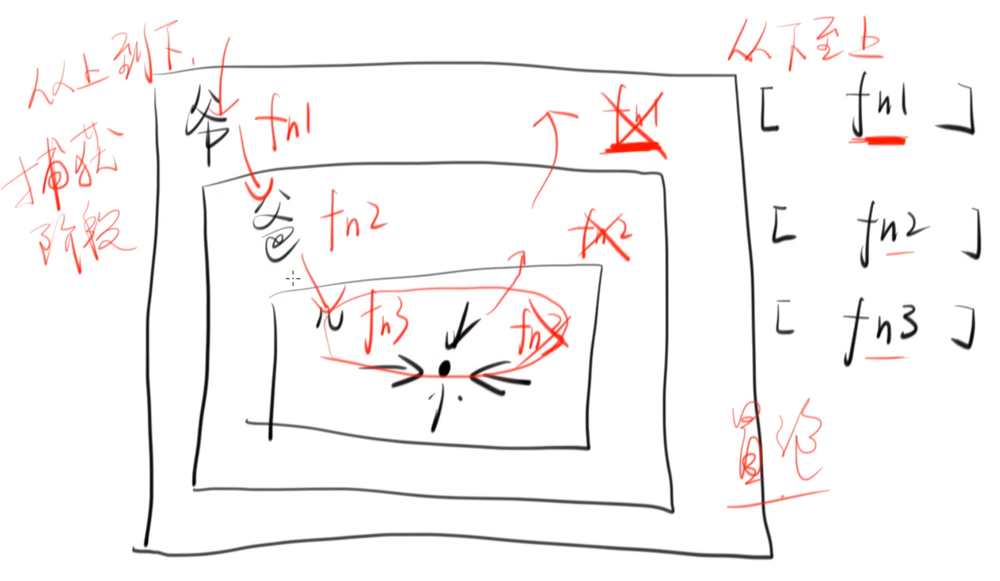

# DOM 事件标准与模型

## DOM Level 0

它不是一个标准，只是对各个浏览器支持的 DOM 事件的统称。

```javascript
btn.onclick = function() {
  console.log('hi')
}
btn.onmouseenter = function() {
  console.log('mouseenter')
}
btn.onmouseleave = function() {
  console.log('mouseleave')
}
```


## DOM Level 1

把各个浏览器支持的 DOM 事件进行汇总，形成规范标准。


## DOM Level 2

**现在主要的规范标准。**

添加了更多 DOM 事件，以及制定了事件流、事件捕获、事件冒泡和事件取消等更多标准。

```javascript
btn.addEventListener('click', function() {
  console.log('hi')
})
btn.addEventListener('mouseenter', function() {
  console.log('mouseenter')
})
btn.addEventListener('mouseleave', function() {
  console.log('mouseleave')
})
```

### 和 DOM Level 1 的区别

它们区别在于，DOM Level 1 只是一个属性，属性是唯一的，也就是说一个元素只可能有一个 `onclick` 属性，这意味着不能多次绑定同一事件。

```javascript
btn.onclick = function() {  // 将会被覆盖
  console.log(1)
}
btn.onclick = function() {
  console.log(2)
}
```

而 DOM Level 2 则是一种队列，可以对同一事件进行多次绑定。

```javascript
// 不会被覆盖
btn.addEventListener('click', function() {
  console.log('hi')
})
btn.addEventListener('click', function() {
  console.log('hello')
})
```

使用 `removeEventListener` 可以移除队列中的事件绑定。

```javascript
function f1() {
  console.log('hi')
}
function f2() {
  console.log('hello')
}
btn.addEventListener('click', f1)
btn.addEventListener('click', f2)
btn.removeEventListener('click', f1)
// 'hello'
```

### 实现 .one()

使用 `removeEventListener` 还可以实现对事件绑定仅监听一次。

```javascript
function f1() {
  console.log('hi')
  btn.removeEventListener('click', f1)
}
btn.addEventListener('click', f1)
// 只在第一次点击 btn 时才会打印出 'hi'
```

### 事件模型（冒泡和捕获）

`removeEventListener` 还可以接受第三个参数：

- 如果是 `false`，那么会进行事件冒泡。
- 如果是 `true`，那么会进行事件捕获。

在下图事件流中，会询问两遍（先捕获后冒泡），根据第三个参数来确定具体在哪个阶段执行函数。



### 阻止事件冒泡

```javascript
e.stopPropagation()
```

[示例（popover）](https://github.com/JinChengJoker/stopPropagation-demo)


## DOM Level 3

没有再对 DOM 事件进行更多的修改。