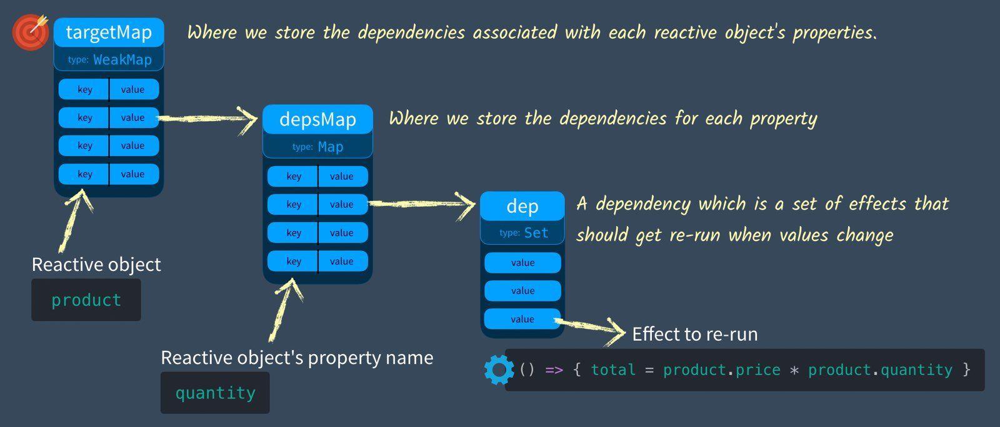

# Vue3 响应性原理之 track & trigger

## 什么是数据响应式

```html
<div id="app">
  <div>Price: ${{ product.price }}</div>
  <div>Total: ${{ product.price * product.quantity }}</div>
  <div>Taxes: ${{ totalPriceWithTax }}</div>
</div>
<script src="https://cdn.jsdelivr.net/npm/vue"></script>
<script>
  var vm = new Vue({
    el: '#app',
    data: {
      product: {
        price: 5,
        quantity: 2
      }
    },
    computed: {
      totalPriceWithTax() {
        return this.product.price * this.product.quantity * 1.03
      }
    }
  })
</script>
```

当我们修改`product.price = 10`的时候，`vue`至少会做三件事情：

1. 在页面上更新`price`。
2. 重新计算`price * quantity`并更新页面。
3. 再次调用`totalPriceWithTax`函数并更新页面。


那么`vue`是如何知道我们更新了`price`，并做出这些响应的？

当然，在`vue`的世界里，这一切都显得理所当然。但是当我们把这种思维带回到`JS`的编程方式中，就会发现并不是这样。

现在先把`vue`放到一边，提取出一些关键的代码：

```javascript
let product = { price: 5, quantity: 2 }
let total = product.price * product.quantity  // 10
product.price = 20
console.log(`total is ${total}`)
// total is 10
```

在`vue`里我们期望最后打印结果为`total is 40`。

但是在`JS`里我们得到的结果却是`total is 10`，这是因为`JS`并不具备响应性。


## dep - 保存代码并能够再次运行

要实现预期的效果，那当我们修改了`product.price`的之后，要是能再次运行`total = product.price * product.quantity`不就可以了？

所以我们需要一个能保存我们*想要再次运行的代码*的地方，并且当`product.price`更新后（后面再讲如何监控数据更新），能重新找到这些代码并运行它。


我们可以把代码记录成一个函数来达到这种目的，一般把这种函数叫做`effect`。

```javascript
let product = { price: 5, quantity: 2 }
let total = 0

let effect = () => { total = product.price * product.quantity }
```

然后可以用一个`Set`来存储它，并用一个名为`track`的函数来做这件事情：

```javascript
let dep = new Set()

function track() {
  dep.add(effect)  // Store the current effect
}
```


最后还需要一个触发函数`trigger`能够运行保存的所有`effect`：

```javascript
function trigger() { 
  dep.forEach(effect => effect()) 
}
```

完整的代码：

```javascript
let product = { price: 5, quantity: 2 }
let total = 0

let effect = () => {
  total = product.price * product.quantity
}

let dep = new Set()

function track() {
  dep.add(effect)
}

function trigger() {
  dep.forEach(effect => effect())
}

track()
effect()
console.log(total)  // 10

product.price = 20
trigger()
console.log(total) // 40
```

*`effect`、`track`、`trigger`这三个单词将会伴随着整个`vue3`的响应式实现*。


## depsMap - 多个属性各自的 dep

上面的代码中，`track`和`trigger`实际上和数据并没有什么直接的关联。即：无论你改变`product.price`还是`product.quantity`，甚至你什么都不用改变，都能随时调用`trigger`。

但是实际上我们更想要的效果是：

1. 你要告诉我对哪个数据进行监控。
2. 我会找出哪些代码依赖了这个数据，并把这些代码保存起来。
3. 你改变了哪个数据的时候要告诉我。
4. 我根据你改变的数据去找到对应的代码并执行。

所以对于不同的数据，它们应该都有各自的`dep`。这样每次调用`track`和`trigger`的时候，都要接收一个`key`：

- `track`根据`key`判断是否存在对应的`dep`，如果没有就新建一个，然后把`effect`保存到`dep`里。
- `trigger`根据`key`找对应的`dep`，如果存在就执行对应`dep`的所有`effect`。

我们可以用一个`Map`来记录这些关系：


完整的代码：

```javascript
let product = { price: 5, quantity: 2 }
let total = 0

let effect = () => {
  total = product.price * product.quantity
}

const depsMap = new Map()

function track(key) {
  let dep = depsMap.get(key)
  if (!dep) {
    depsMap.set(key, (dep = new Set()))
  }
  dep.add(effect)
}

function trigger(key) {
  let dep = depsMap.get(key)
  if (dep) {
    dep.forEach(effect => {
      effect()
    })
  }
}

track('quantity')
effect()
console.log(total)  // 10

product.quantity = 3
trigger('quantity')
console.log(total)  // 15
```


## targetMap - 多个对象各自的 depsMap

上面已经解决了一个对象中存在多个属性的问题，同样的，也可能会有多个这样的对象。

即对于不同的对象，它们都会有各自的`depsMap`。这样每次调用`track`和`trigger`的时候，都要接收一个目标对象`target`和一个`key`：

- `track`先根据`target`判断是否存在对应的`depsMap`，如果没有就新建一个；再根据`key`判断在`depsMap`中是否存在对应的`dep`，如果没有就新建一个；最后把`effect`保存到`dep`里。
- `trigger`先根据`target`找对应的`depsMap`；再根据`key`在`depsMap`中找对应的`dep`，如果存在就执行对应`dep`的所有`effect`。

我们可以用一个`WeakMap`来记录这些关系，`WeakMap`可以看成是一种特殊的`Map`，其键必须是对象，而值可以是任意的：



完整的代码：

```javascript
let product = { price: 5, quantity: 2 }
let total = 0

let effect = () => {
  total = product.price * product.quantity
}

const targetMap = new WeakMap()

function track(target, key) {
  let depsMap = targetMap.get(target)
  if (!depsMap) {
    targetMap.set(target, (depsMap = new Map()))
  }

  let dep = depsMap.get(key)
  if (!dep) {
    depsMap.set(key, (dep = new Set()))
  }

  dep.add(effect)
}

function trigger(target, key) {
  const depsMap = targetMap.get(target)
  if (!depsMap) {
    return
  }

  let dep = depsMap.get(key)
  if (dep) {
    dep.forEach(effect => {
      effect()
    })
  }
}

track(product, 'quantity')
effect()
console.log(total)  // 10

product.quantity = 3
trigger(product, 'quantity')
console.log(total)  // 15
```


## 总结

我们基本上已经实现了一开始期望的需求：

> *一个能保存我们想要再次运行的代码的地方，并且当`product.price`更新后，能重新找到这些代码并运行它。*

但是还有最后一个问题，现在都是手动去调用`track`和`trigger`，而理想情况是，我只需要修改数据，其它的工作都能自动完成。

所以还需要有一个办法能够自动监控/代理数据，并自动做出响应：[Vue3 响应性原理之 Proxy & Reflect](https://jinchengjoker.github.io/posts/vue/vue3_reactivity_proxy_reflect/)。

*以上例子和思路均来源于官方教程 [Vue Mastery](https://www.vuemastery.com/courses/vue-3-reactivity/vue3-reactivity)*。