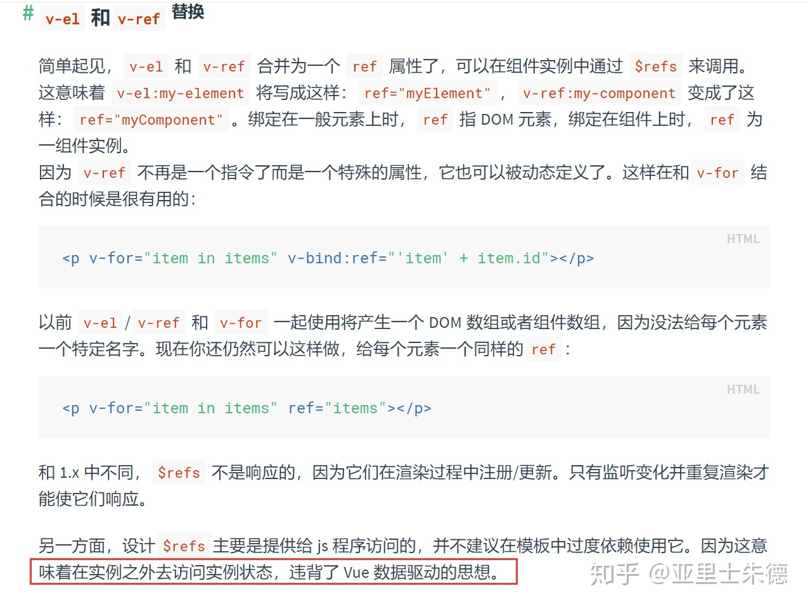

# Vue 之 MVVM

## Vue 是 MVVM？

### v1.0 版本

在[`vue v1.0`](https://v1-cn.vuejs.org/guide/overview.html)版本的官网上有这么一张图： 

可以看到在`v1.0`版本，当时`vue`把自己定义为一个`MVVM`模型的框架：

> *Vue.js 拥抱数据驱动的视图概念。通俗地讲，它意味着我们在普通 HTML 模板中使用特殊的语法将 DOM “绑定”到底层数据。一旦创建了绑定，DOM 将与数据保持同步。每当修改了数据，DOM 便相应地更新。这样我们应用中的逻辑就几乎都是直接修改数据了，不必与 DOM 更新搅在一起。*

### v2.x v3.x 版本

但是在后来的版本，`vue`的官网上就移除了这张图的介绍，取而代之的是下面这句话：

> *虽然没有完全遵循 MVVM 模型，但是 Vue 的设计也受到了它的启发。*

在`v2.x`、`v3.x`版本，`vue`更像是一个`MV*`模型，因为它确实有些地方没有遵循`MVVM`模型。其实不必纠结这个`*`具体是指什么。

## 先顺便了解一下 MVC

引用[阮一峰老师的文章](https://www.ruanyifeng.com/blog/2015/02/mvcmvp_mvvm.html)，在*前端层面*可以很容易的理解什么是`MCV`：

> - *模型（Model）：数据保存*
> - *视图（View）：用户界面*
> - *控制器（Controller）：业务逻辑*

> 1. *View 传送指令到 Controller*
> 2. *Controller 完成业务逻辑后，要求 Model 改变状态*
> 3. *Model 将新的数据发送到 View，渲染出视图（用户得到反馈）*

## Vue 是 MVVM

`MVVM`是`Model-View-ViewModel`的缩写。阮一峰老师也介绍了`MVVM`，但是实在是过于概括。这里推荐[廖雪峰老师的文章](https://www.liaoxuefeng.com/wiki/1022910821149312/1108898947791072)：

> *MVVM 最早由微软提出来，它借鉴了桌面应用程序的 MVC 思想，在前端页面中，把 Model 用纯 JavaScript 对象表示，View 负责显示，两者做到了最大限度的分离。*

> *把 Model 和 View 关联起来的就是 ViewModel。ViewModel 负责把 Model 的数据同步到 View 显示出来，还负责把 View 的修改同步回 Model。*

这说的不就是双向绑定吗？这句话跟`vue 1.0`版本的介绍完美契合，所以明白了为什么当时`vue`说自己是一个`MVVM`模型的框架。

## Vue 不是 MVVM

那又为什么说`vue`不是`MVVM`模型呢？我又找到了[知乎的这个问题](https://www.zhihu.com/question/327050991)的一个答案：

> *ref 属性虽然为父组件操作子组件大开了方便之门，但是它绕开了 ViewModel 来访问 View。*

> *严格的 MVVM 要求 View 不能和 Model 直接通信，而 vue 在组件提供了 $refs 这个属性，可以直接操作 View，违反了这一要求。*

所以说`vue`不是`MVVM`模型，或者说没有完全遵循`MVVM`模型。

## 总结

说白了，无论是`MVC`中的`C`，还是`MVVM`中的`VM`，都好像是用来*干脏活累活*的：

- `MVC`中的`C`对应业务逻辑
- `MVVM`中的`VM`对应`vue`的数据绑定和事件监听

可以把`VM`理解为就是`C`的一个实例，因为还有`MVP`，甚至以后可能还有`MVA`、`MVB`...等等，它们多多少少都是借鉴了`MVC`而演变而来。

所以`vue`是`MVVM`也好，不是也罢，这些都不重要，重要的是了解它们背后的思想和原理。